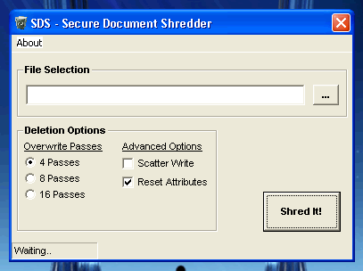



## SDS\! \- Secure Document Shredder

### Description

SDS - Secure Document Shredder V1

A secure document destruction class. Method uses crypto api to generate random data blocks, and overwrites file in multiple passes at file offsets proportioned to file size, (for speed). All writes are done with api to ensure commits, and disk cache is flushed at bottom of each cycle.

Some good examples of various api usage, and (of course), a decent file shredder.

Comments welcome..

Cheers John
 
### More Info
 

             |
---                |---
**Submitted On**   |2006-04-13 15:07:40
**By**             |[Steppenwolfe](https://github.com/Planet-Source-Code/PSCIndex/blob/master/ByAuthor/steppenwolfe.md)
**Level**          |Intermediate
**User Rating**    |5.0 (30 globes from 6 users)
**Compatibility**  |VB 6\.0
**Category**       |[Complete Applications](https://github.com/Planet-Source-Code/PSCIndex/blob/master/ByCategory/complete-applications__1-27.md)
**World**          |[Visual Basic](https://github.com/Planet-Source-Code/PSCIndex/blob/master/ByWorld/visual-basic.md)
**Archive File**   |[SDS\!\_\-\_Sec1986884132006\.zip](https://github.com/Planet-Source-Code/steppenwolfe-sds-secure-document-shredder__1-65004/archive/master.zip)

